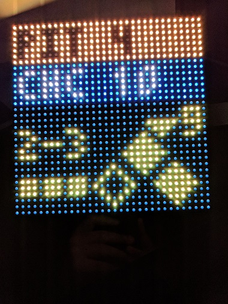
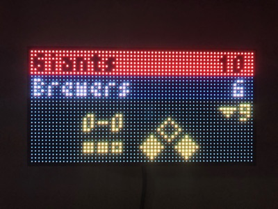
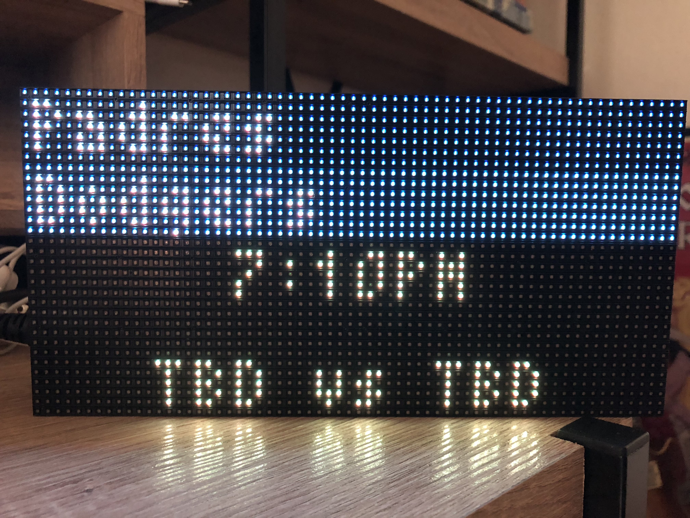
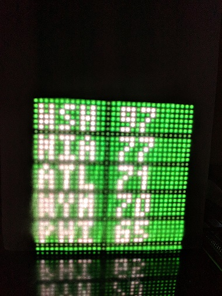
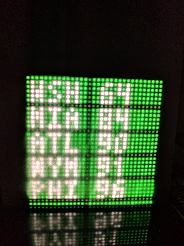
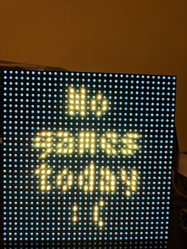

# mlb-led-scoreboard
An LED scoreboard for Major League Baseball. Displays a live scoreboard for your team's game on that day.

Forked from [MLB-LED-Scoreboard/mlb-led-scoreboard](https://github.com/MLB-LED-Scoreboard/mlb-led-scoreboard) — this fork adds support for the **16x64 board** and is running on a Raspberry Pi Zero.

## Supported Boards
| Dimensions | Status |
|---|---|
| 64x16 | ✅ Supported (this fork) |
| 64x32 | ✅ Supported |
| 128x32 | ✅ Supported |
| 128x64 | ✅ Supported |
| 32x32 | ✅ Supported |

## Table of Contents
* [Features](#features)
* [Hardware](#hardware)
* [Installation](#installation)
* [Usage](#usage)
  * [Running Remotely (Mac)](#running-remotely-mac)
  * [Running Directly on the Pi](#running-directly-on-the-pi)
* [Configuration](#configuration)
* [Flags](#flags)
* [Personalization](#personalization)
  * [Custom Board Layout](#custom-board-layout)
  * [Custom Colors](#custom-colors)
  * [Weather](#weather)

---

## Features

### Live Games
Displays live in-progress games with score, inning, bases, outs, and pitch count. Rotates through all games of the day every 15 seconds.

 

### Pregame
Shows the probable starting pitchers, game time, and weather forecast before a game starts.



### Division Standings
Displays standings for your preferred division on off-days or always if configured.

 

### Off Day
Shows local weather and scrolling MLB news headlines when your team isn't playing.



---

## Hardware

This fork is running on:
- **Raspberry Pi Zero** (latest 32-bit Raspberry Pi OS, installed via [Raspberry Pi Imager](https://www.raspberrypi.com/software/))
- **64x16 LED matrix** connected via an **Adafruit HAT (PWM mode)**

> The Pi's built-in sound module (`snd_bcm2835`) conflicts with the LED matrix's hardware pulse. The `--led-no-hardware-pulse=1` flag is required to avoid this — see [Usage](#usage).

---

## Installation

### Requirements
```bash
sudo apt-get update
sudo apt-get install git python3-pip sshpass
```

### Clone and install
```bash
git clone --recursive https://github.com/real-oneill/mlb-led-scoreboard
cd mlb-led-scoreboard/
sudo ./install.sh
```

This installs the `rpi-rgb-led-matrix` bindings and the following Python libraries:

- `MLB-StatsAPI` — fetches live game data, schedules, and standings from the official MLB Stats API
- `pyowm` — OpenWeatherMap integration for weather on off-day and pregame screens
- `bdfparser` — parses BDF font files from `assets/fonts/patched/`
- `tzlocal`, `pytz` — timezone handling
- `feedparser` — RSS feeds for news headlines

### Configuration
Copy the example config and edit it:
```bash
cp config.example.json config.json
```

Set your preferred team, division, weather API key, and location. See [Configuration](#configuration) for all options.

---

## Usage

### Running Remotely (Mac)

**One-shot command from your Mac terminal** (requires `sshpass` — install with `brew install hudochenkov/sshpass/sshpass`):

```bash
sshpass -p 'YOUR_PASSWORD' ssh -o StrictHostKeyChecking=no pi@scoreboard.local \
  'cd /home/pi/mlb-led-scoreboard && bash run.sh'
```

This SSH's into the Pi, runs `run.sh`, and returns control to your terminal. The scoreboard keeps running in the background. Logs are written to `logs/mlbled.log`.

**To stop the scoreboard:**
```bash
sshpass -p 'YOUR_PASSWORD' ssh -o StrictHostKeyChecking=no pi@scoreboard.local 'sudo killall python'
```

**To tail logs:**
```bash
sshpass -p 'YOUR_PASSWORD' ssh -o StrictHostKeyChecking=no pi@scoreboard.local 'tail -f /home/pi/mlb-led-scoreboard/logs/mlbled.log'
```

### Running Directly on the Pi

If you're SSH'd in or on the Pi directly:
```bash
cd /home/pi/mlb-led-scoreboard
bash run.sh
```

Or run in the foreground (useful for debugging):
```bash
sudo python main.py \
  --led-gpio-mapping="adafruit-hat-pwm" \
  --led-rows=16 \
  --led-cols=64 \
  --led-slowdown-gpio=2 \
  --led-no-hardware-pulse=1
```

---

## Configuration

Copy `config.example.json` to `config.json` and adjust values. Your `config.json` is merged on top of the example, so you only need to include the keys you want to override.

```
"preferred"
  "teams"                      Array   Preferred teams. First team is your favorite. Example: ["White Sox"]
  "divisions"                  Array   Preferred divisions to rotate standings through. Example: ["AL Central"]

"news_ticker"
  "always_display"             Bool    Show news ticker at all times
  "team_offday"                Bool    Show news ticker when your team has no game
  "preferred_teams"            Bool    Include headlines from your preferred teams
  "traderumors"                Bool    Include MLB trade rumor headlines
  "mlb_news"                   Bool    Include MLB front page news
  "countdowns"                 Bool    Include countdowns (e.g. days until playoffs)
  "date"                       Bool    Show today's date in the ticker
  "date_format"                String  Date format string. See strftime.org

"standings"
  "always_display"             Bool    Always show standings
  "mlb_offday"                 Bool    Show standings when no MLB games are scheduled
  "team_offday"                Bool    Show standings when your preferred team has no game
  "display_no_games_live"      Bool    Show standings when no games are currently live

"rotation"
  "enabled"                    Bool    Rotate through each game of the day
  "scroll_until_finished"      Bool    Wait for scrolling text to finish before rotating
  "only_preferred"             Bool    Only rotate through your preferred teams' games
  "only_live"                  Bool    Only rotate through games currently in progress
  "rates"                      Dict    Rotation interval per game state: "live", "pregame", "final" (seconds)
  "while_preferred_team_live"
    "enabled"                  Bool    Allow rotation while preferred team is live
    "during_inning_breaks"     Bool    Allow rotation during inning breaks

"weather"
  "apikey"                     String  OpenWeatherMap API key (free at openweathermap.org)
  "location"                   String  Location string, e.g. "Chicago,il,us"
  "metric_units"               Bool    true for Celsius/m/s, false for Fahrenheit/mph

"time_format"                  String  "12h" or "24h"
"end_of_day"                   String  24h time to consider start of new day, e.g. "00:00"
"full_team_names"              Bool    Show full team names instead of abbreviations (64-wide boards only)
"scrolling_speed"              Integer 0–6, higher is faster
"api_refresh_rate"             Integer Seconds between MLB API refreshes (minimum 3)
"pregame_weather"              Bool    Show weather forecast in pregame scrolling text
"debug"                        Bool    Write debug output to logs/mlbled.log
"demo_date"                    String  "YYYY-MM-DD" to demo a specific date, or false to disable
```

---

## Flags

Passed directly to the `rpi-rgb-led-matrix` library:

```
--led-rows                Display rows. 16 for 16x64. (Default: 32)
--led-cols                Panel columns. 64 for 16x64. (Default: 32)
--led-chain               Daisy-chained boards. (Default: 1)
--led-parallel            Parallel chains, for Pi 2/Plus models. 1..3. (Default: 1)
--led-brightness          Brightness level. Range: 1..100. (Default: 100)
--led-gpio-mapping        Hardware mapping: regular, adafruit-hat, adafruit-hat-pwm
--led-slowdown-gpio       Slow down GPIO writes. Range: 0..4. (Default: 1, use 2 for Pi Zero)
--led-no-hardware-pulse   Disable hardware pin-pulse generation. Required if Pi sound module is loaded.
--led-rgb-sequence        Channel order if colors appear wrong. (Default: RGB)
--led-pwm-bits            PWM bit depth. Range 1..11. (Default: 11)
--led-scan-mode           0 = Progressive, 1 = Interlaced. (Default: 1)
```

---

## Personalization

### Custom Board Layout
Coordinate files live in `coordinates/`. The reference file for each board size is `coordinates/w{cols}h{rows}.example.json`. To customize, copy it to `coordinates/w{cols}h{rows}.json` — your file will be merged on top of the example.

The 16x64 layout (`coordinates/w64h16.example.json`) is custom to this fork and hand-tuned for the hardware.

### Custom Colors
Color files live in `colors/`. To override team or scoreboard colors, copy `colors/teams.example.json` → `colors/teams.json` or `colors/scoreboard.example.json` → `colors/scoreboard.json` and edit. Your file is merged on top of the example.

### Weather
Sign up for a free API key at [openweathermap.org](https://home.openweathermap.org/users/sign_up). Add it to `config.json` under `weather.apikey`. Set `weather.location` to your city, e.g. `"Chicago,il,us"`.

---

## Sources
- [rpi-rgb-led-matrix](https://github.com/hzeller/rpi-rgb-led-matrix) — low-level LED matrix driver (included as a submodule)
- [MLB-StatsAPI](https://github.com/toddrob99/MLB-StatsAPI) — official MLB Stats API Python wrapper
- [pyowm](https://github.com/csparpa/pyowm) — OpenWeatherMap API client

### Accuracy Disclaimer
Data accuracy depends on MLB's Stats API. Incorrect scores, pitchers, or other data are an upstream issue.

---

## Licensing
GNU Public License v3. If you intend to sell these, the code must remain open source.
